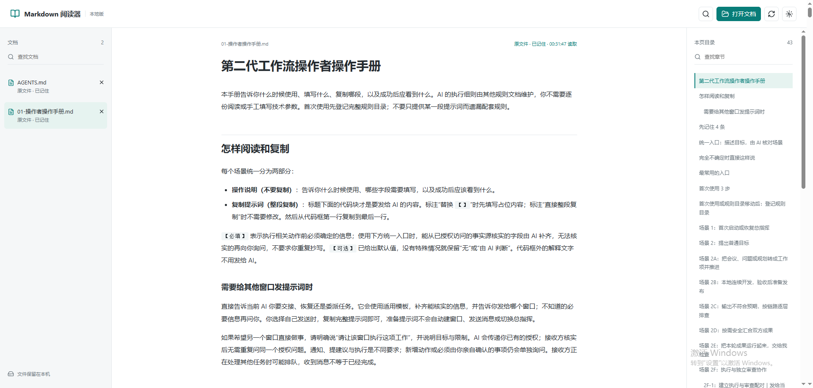
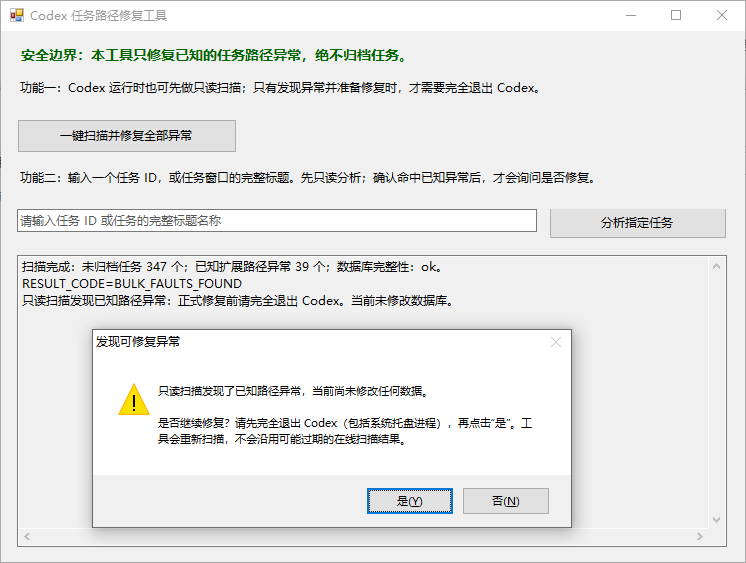

# 真实运行效果 / Real-world previews

[返回中文首页](README.md) | [Back to the English overview](README.en.md)

这里集中展示已经完成隐私核验、并由仓库所有者明确确认可公开的真实运行截图。图片只是帮助访客理解功能，不是规则、提示词或工具的运行依赖；即使当前阅读器不显示图片，对应文档和工具仍可正常使用。点击图片可以查看原始尺寸。

This page collects real runtime screenshots that passed a privacy review and were explicitly approved for public display by the repository owner. They are optional visual references, not runtime dependencies; the linked manuals and tools remain usable when a Markdown viewer does not display images. Select an image to view it at its original size.

## Markdown 阅读器与总指挥工作流 / Markdown reader and commander workflow

在本地 Markdown 阅读器中打开总指挥操作手册：左侧切换已选择的文档，中间阅读正文和提示词，右侧按章节定位。手册通过选择原文件加入，不随阅读器内置；浏览器支持且授权有效时，可重新读取保存后的原文。

Open the commander manual in the local Markdown reader: switch selected documents on the left, read content and prompts in the center, and navigate sections on the right. Select the original manual file; the reader does not bundle a snapshot. Rereading saved changes depends on browser support and valid permission.

[阅读器说明 / Reader guide](实用小工具/Markdown阅读器/README.md) | [总指挥操作手册 / Commander manual](总指挥工作流/第二代总指挥的工作模式/01-操作者操作手册.md)

> 隐私说明：截图由操作者提供并授权公开，展示公开手册及界面，来源附加元数据已清除。画面中的读取状态只代表截图时刻，不证明所有浏览器的授权记忆或同步效果。
> Privacy: the operator supplied and approved this screenshot of the public manual and interface. Additional source metadata has been removed. The displayed read status is a captured moment, not proof of permission persistence or synchronization in every browser.

## 场景 2C：按链路逐层排查 / Scene 2C: step-by-step pipeline diagnosis

场景 2C 会把实际执行链拆成可逐步查看的稳定节点，并在同一页面对照输入、处理、输出、失败信号和证据。链路较长时，还可以生成可翻页的本地 HTML，帮助操作者和 AI 一起定位第一处可靠偏差。

Scene 2C reconstructs the actual execution path as stable, reviewable steps and compares inputs, processing, outputs, failure signals, and evidence on one page. Longer pipelines can also be presented as a local step-through HTML document so the operator and AI can locate the first reliable divergence together.

[打开场景 2C 操作入口 / Open the Scene 2C operator entry](总指挥工作流/第二代总指挥的工作模式/01-操作者操作手册.md)

> 隐私说明：图片已遮挡项目标识、版本、时间、坐标、哈希和原始证据；保留的流程阶段名称与二值结果用于说明实际交互方式，不代表所有项目都会产生相同输出。

## Codex 会话交接评估 / Codex session handoff assessment

Windows 工作台支持保存任务 ID、自动读取名称与项目、排序、双语查询和历史恢复。基本报告与详细报告分区展示；不再使用时点击“退出工具”，仅关闭网页不会停止后台服务。

The Windows desk saves task IDs, detects names and projects, and provides ordering, bilingual queries and history restoration. Basic and detailed reports are separate. Select Exit tool when finished; closing the page alone does not stop the service.

[打开工具说明 / Open the tool guide](实用小工具/Codex会话交接评估/README.md)

> 隐私说明：所有可见任务 ID、项目/任务名称、时间、会话路径与报告路径均已实色遮挡；通用统计结构保留用于说明界面。图片仅用于本页功能展示，不构成当前状态或统计准确性的独立证明。
> Privacy: visible task IDs, project/task names, time, session paths and report paths are covered with opaque masks. Generic statistical structure is retained to explain the interface. This screenshot illustrates the interface; it is not independent proof of current state or statistical accuracy.

## Codex 归档路径修复工具 / Codex archive-path repair tool

该工具用于只读扫描已知的 Codex 任务路径异常，并在确认后执行修复；截图展示发现异常后的人工确认界面。

This utility scans known Codex task-path anomalies and asks for confirmation before repair. The screenshot shows the manual confirmation state after an anomaly is detected.

> 隐私说明：截图未显示真实任务 ID、个人联系方式、凭据或本机路径；仅保留工具名称、通用提示和人工确认流程。
> Privacy: no real task ID, personal contact, credential or local path is visible; the tool name, generic messages and manual confirmation flow are retained.
