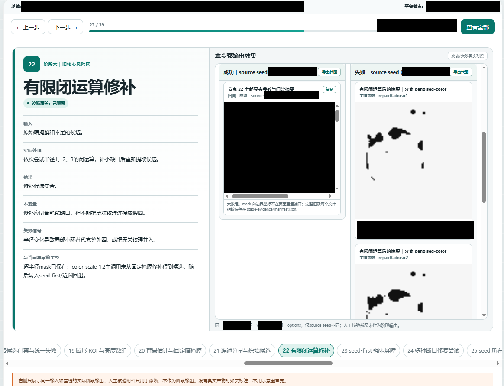

# 真实运行效果 / Real-world previews

[返回中文首页](README.md) | [Back to the English overview](README.en.md)

这里集中展示已经完成隐私核验、并由仓库所有者明确确认可公开的真实运行截图。图片只是帮助访客理解功能，不是规则、提示词或工具的运行依赖；即使当前阅读器不显示图片，对应文档和工具仍可正常使用。点击图片可以查看原始尺寸。

This page collects real runtime screenshots that passed a privacy review and were explicitly approved for public display by the repository owner. They are optional visual references, not runtime dependencies; the linked manuals and tools remain usable when a Markdown viewer does not display images. Select an image to view it at its original size.

## 场景 2C：按链路逐层排查 / Scene 2C: step-by-step pipeline diagnosis

场景 2C 会把实际执行链拆成可逐步查看的稳定节点，并在同一页面对照输入、处理、输出、失败信号和证据。链路较长时，还可以生成可翻页的本地 HTML，帮助操作者和 AI 一起定位第一处可靠偏差。

Scene 2C reconstructs the actual execution path as stable, reviewable steps and compares inputs, processing, outputs, failure signals, and evidence on one page. Longer pipelines can also be presented as a local step-through HTML document so the operator and AI can locate the first reliable divergence together.

[打开场景 2C 操作入口 / Open the Scene 2C operator entry](总指挥工作流/第二代总指挥的工作模式/01-操作者操作手册.md)

> 隐私说明：图片已遮挡项目标识、版本、时间、坐标、哈希和原始证据；保留的流程阶段名称与二值结果用于说明实际交互方式，不代表所有项目都会产生相同输出。

## Codex 会话交接评估 / Codex session handoff assessment

这个只读 PowerShell 工具会汇总本地会话分段、回合增长、文件大小、上下文压缩和交接建议，帮助操作者判断是否应把长任务交接到新对话。终端只给出摘要，可能包含完整输入的详细报告仍保存在本地，不应直接公开。

This read-only PowerShell tool summarizes local session segments, turn growth, file size, compaction events, and a handoff recommendation. The terminal shows a compact summary; the detailed local report may contain complete user input and should not be published without a separate review.

[打开工具说明 / Open the tool guide](实用小工具/Codex会话交接评估/README.md)

> 隐私说明：任务 ID 已遮挡；图片仍显示仓库所有者明确同意公开的本机目录标签、任务名称和运行统计。该授权只适用于这张已确认图片及本预览页，不扩展到其他终端截图或详细报告。
