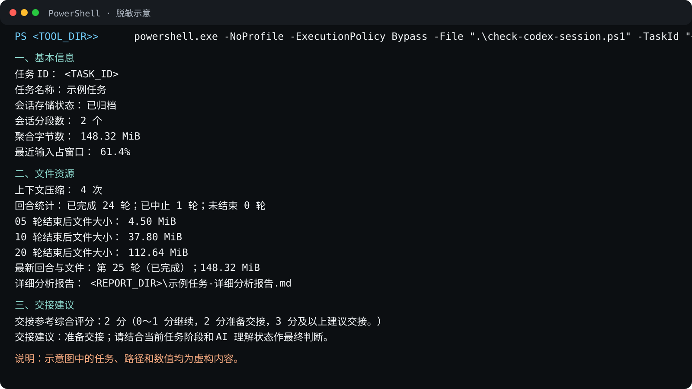

# Codex 会话交接评估

[English](README.en.md)

本目录提供一个只读 PowerShell 脚本，用于查看指定 Codex 任务的名称、一个或多个本地会话分段、回合增长、Token 记录和主要文件占用。传统 Windows PowerShell 可以直接执行；Windows Terminal 只是可选的显示界面。

脚本不会修改会话。终端只显示基本信息、文件资源、详细报告路径和交接建议；Token 排名、文件占用构成及前三个高消耗回合的完整用户输入写入本地 Markdown 详细报告。文件较大或压缩次数较多只是一项诊断信号；网络代理、具体版本回归、图片/工具输出、后台进程和存储性能仍需分别排查。

## 本地任务面板原型

[下载或打开单文件原型](task-panel-prototype.html)。将 HTML 文件保存到本机后，用现代浏览器打开即可，无需终端、服务器或安装依赖；在 GitHub 上点击链接通常先显示源码，需要下载文件后打开。

原型使用六个固定的虚构任务，演示名称/ID/项目搜索、重名区分、收藏、单项查询、批量刷新与停止、结果摘要、缓存时间和详细报告弹窗。所有查询和指标均为模拟，不读取真实会话，也不接入现有 PowerShell 分析器。

首次打开可直接操作：点击星标收藏，点击“查询”或“刷新”生成模拟结果；勾选任务后点击“刷新选中”。“资料整理”首次查询模拟失败，再次点击“重试”成功；“演示设置与数据说明”可让当前结果立即过期，或重置全部示例数据。失败和取消不会覆盖已有成功结果；筛选后批量刷新仍包含已选但暂不可见的任务，按钮显示总数，可用“清除选择”重选。

收藏与结果仅保存在当前浏览器的本地存储，不包含对话正文。结果超过五分钟显示过期，该时间仅为演示设定。直接打开本地文件时，浏览器的存储策略可能不同；更换浏览器或文件位置可能无法延续记录。存储不可用时页面明确提示，并继续提供本次打开期间的操作。

界面共用一份 HTML，保留 Windows/macOS 浏览器使用方向；当前只验证 Windows Edge 无头环境，未进行 macOS/Safari 实机验证。不保证真实数据读取也可沿用同样的跨平台方式。后续须确定文件选择与权限方案，将真实解析器输出接入界面，并验证缓存失效、大日志处理和敏感报告边界。

## 浏览器内分析验证

[打开虚构日志验证页](browser-analysis-lab.html)，下载页内小型样例后，通过文件选择开始实际解析；它与上面的固定数据任务面板分开，不连接真实 Codex 会话。仅需这一份 HTML，不需要本地服务器或依赖安装。

Windows Edge 无头验证已覆盖约 64 MiB 虚构日志、后台响应、内容变更导致缓存失效、损坏输入与取消。结果缓存仅在页面内存中保留最多五项；磁盘文件变化后需要重新选择，不能用旧文件对象冒充最新内容。macOS/Safari 尚未实测，当前简化格式不等同现有分析器。详见[可行性报告、测量结果与接入条件](BROWSER_ANALYSIS_FEASIBILITY.md)。

## 文件清单

1. `check-codex-session.ps1`：在终端输出任务 ID、任务名称、会话分段数、聚合字节数、分段时间范围、存储状态、回合与文件增长、自动压缩次数、最近输入占窗口比例和交接建议，并生成详细分析报告。
2. [快速使用说明](查看当前任务本地对话文件大小.md)：适合第一次使用时直接照着操作的精简 Markdown 指南，可在 GitHub 中直接阅读。
3. `运行效果示意.svg`：使用虚构占位符重绘的终端输出示意，不包含真实任务、用户名或本地路径。
4. [真实运行截图](运行效果截图.png)：操作者已逐文件确认可公开，任务 ID 已遮挡；图片仍包含本人本机目录标签和任务名称，现由[统一效果预览页](../../SHOWCASE.md)直接展示，本页不重复嵌入大图。

## 快速开始

第一次使用时，请直接打开 [快速使用说明](查看当前任务本地对话文件大小.md)。本文后续内容只解释指标、准确性边界和可选显示设置，不再重复操作步骤。



> 这是按真实输出结构重绘的示意图，数值和路径均为虚构示例，不代表 OpenAI 官方阈值。

## 选择输出语言

脚本默认使用简体中文，原有命令不需要修改。需要英文终端和英文详细报告时，显式传入 `-Language en-US`：

```powershell
powershell.exe -NoProfile -ExecutionPolicy Bypass -File ".\check-codex-session.ps1" -TaskId "<TASK_ID>" -Language en-US
```

也可以显式指定中文：

```powershell
powershell.exe -NoProfile -ExecutionPolicy Bypass -File ".\check-codex-session.ps1" -TaskId "<TASK_ID>" -Language zh-CN
```

每次运行只显示一种语言。任务名称、用户输入、会话路径和其他原始数据保持原样，不会被翻译。

## 如何理解结果

1. “会话存储状态”只表示分段位于活动目录还是归档目录；“未归档”不等于 Codex 当前正在生成回复。两类目录同时存在时会明确显示混合状态。
2. 同一任务 ID 可能对应多个 rollout JSONL 存储分段，任务 ID 本身不变。脚本先按文件名发现候选，再读取首条 `session_meta.payload.id` 精确核验归属；内部 ID 不匹配的候选不会参与聚合。
3. 通过核验的分段按 `session_meta.timestamp` 和完整路径稳定排序。来源或模型提供方冲突、时间重叠等无法安全解释的情况会报错；版本、编码、存储位置等可继续处理的差异会给出提醒。
4. 脚本按 `turn_id`、开始事件和终止边界识别回合；重复的 `turn_context` 会合并，不能把每条 `turn_context` 都当成一个界面回合。完成、中止和未结束回合会分别统计，不会只因用户输入文字相同就合并两个真实尝试。
5. 文件大小里程碑按已识别回合序号每 5 轮输出一次，即第 5、10、15、20、25、30 轮……；只输出早于最新回合的里程碑，最新回合始终单独输出一次。中止回合也属于真实回合，不会导致后续里程碑缺失；若某个历史回合没有明确终止边界，则显示无法取得，而不是虚构大小。
6. Token 排名使用本地 `total_token_usage` 累计快照的递增差值。`M tokens` 表示百万 Token；Token 是模型计数单位，不能固定换算成 MB 或 MiB。脚本另列的“本轮 JSONL 增长”才是真实文件字节，并使用 MiB（1 MiB = 1,048,576 B）。
7. 相同累计 Token 快照不会重复计算；累计值回退时会重新建立基线。每个后续分段的首个累计快照也只作基线，避免把上一分段的历史累计量重复计入，代价是边界处可能少计并会明确提醒。
8. 文件占用排名按非重叠类别统计；内联 Base64 图片或附件会从所在记录中单独剥离。它反映全部已核验分段的磁盘 JSONL 构成，不等同于模型 Token 消耗或账单。
9. 终端不输出对话正文、工具输出原文或图片内容；详细报告只展开 Token 消耗前三回合的完整用户输入，不展开工具输出或图片内容。
10. 脚本根据聚合会话大小和历史压缩次数形成综合评分；最近输入占窗口比例作为观察信息。
11. 容量分级、压缩次数分级和 85% 观察线都是本地经验规则，并非 OpenAI 官方限制。
12. 不要只因达到单一阈值就打断复杂任务。交接前应确认当前阶段已完成，或至少处于可交接断点。
13. 如果 AI 已出现忘记约束、重复执行或前后矛盾，应提高交接优先级。

## 性能与准确性边界

1. 脚本逐段、逐行流式扫描，不会一次把全部会话文件载入内存；内存峰值仍会受到“最大单条 JSONL 记录”影响。
2. 活动任务可能在扫描期间继续写入。任一分段发生变化时脚本都会提醒，结果以本次实际读取到的数据为准。
3. Codex 本地 JSONL 属于实现数据，不是稳定的公共 API。字段缺失或格式变化时，脚本会降级输出并提示，而不会虚构 Token 排名。
4. 任务名称按任务 ID 从 Codex 本地任务索引读取，并以最后一条有效名称为准；索引缺失、损坏或格式变化时显示“未取得”，不会根据对话内容猜测名称。
5. 详细报告使用带 BOM 的 UTF-8 写入并立即严格回读；验证成功后才原子替换同一任务的旧报告。写入或回读失败时保留旧报告，不留下半份文件。
6. 脚本不自动打开报告、不访问网络，也不为生成报告二次扫描整个会话。实际耗时仍受会话大小、单条记录大小、磁盘、杀毒软件和同步程序影响，不能对所有环境承诺固定 3 秒或绝对零卡顿。

需要 AI 辅助判断时，可以发送：

```text
请独立判断当前任务是否适合交接到新对话。重点检查：当前阶段是否已完成或处于可交接断点，以及你是否出现忘记约束、重复执行、前后矛盾等理解不足。请明确回答“继续当前对话”或“建议交接”，并简述依据。
```

## 可选显示设置

Windows Terminal 可以单独调整终端文字显示。若希望行距稍宽，可在其 `settings.json` 对应配置中使用：

```json
"font": {
  "cellHeight": "1.25"
}
```

该设置只影响 Windows Terminal 的显示，不改变 PowerShell 脚本输出，也不适用于 TXT 文件本身。
