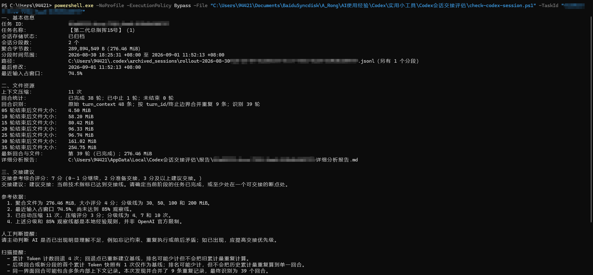

# Codex 会话交接评估：快速使用

这个工具会只读分析指定 Codex 任务的本地会话文件，显示会话大小、回合数、上下文压缩次数等信息，并给出是否适合交接的参考建议。脚本不会修改原会话。

## 第一步：取得任务 ID

在需要检查的 Codex 任务中发送下面这句话：

> **复制提示词**

```text
请只回复当前任务的任务 ID，不要补充其他内容。
```

任务 ID 通常类似：`00000000-0000-0000-0000-000000000000`。

## 第二步：运行检查

1. 打开保存本工具的文件夹。
2. 在文件夹空白处右键，选择“在终端中打开”；也可以先打开 PowerShell，再进入该文件夹。
3. 复制下面的命令，只替换 `<TASK_ID>`：

```powershell
powershell.exe -NoProfile -ExecutionPolicy Bypass -File ".\check-codex-session.ps1" -TaskId "<TASK_ID>"
```

也可以不填写任务 ID，让脚本运行后再提示输入：

```powershell
powershell.exe -NoProfile -ExecutionPolicy Bypass -File ".\check-codex-session.ps1"
```

成功后，终端会显示任务基本信息、会话资源、交接建议和详细报告路径。详细报告默认保存在本工具的 `报告` 文件夹中。



## 第三步：结合任务阶段作最终判断

脚本给出的分数是本地经验指标，不能代替对当前工作阶段的判断。把下面这段话发送到被检查的任务中：

> **复制提示词**

```text
请独立判断当前任务是否适合交接到新对话。重点检查：当前阶段是否已完成或处于可交接断点，以及你是否出现忘记约束、重复执行、前后矛盾等理解不足。请明确回答“继续当前对话”或“建议交接”，并简述依据。
```

## 常见问题

- 提示“任务 ID 格式不正确”：确认复制的是完整任务 ID，且没有多余的中文括号或空格。
- 提示找不到任务：确认任务 ID 属于当前电脑上的 Codex 会话；归档任务也可以检查。
- PowerShell 阻止脚本运行：请使用上面的完整命令，其中的 `-ExecutionPolicy Bypass` 只对这一次 PowerShell 进程生效。
- 需要了解指标含义或自定义报告路径：请继续阅读同目录的 [README](README.md)。

> [!WARNING]
> 详细报告可能包含完整用户输入、本地路径或其他敏感信息。请先人工检查并脱敏，不要直接上传到公开仓库或公开平台。
