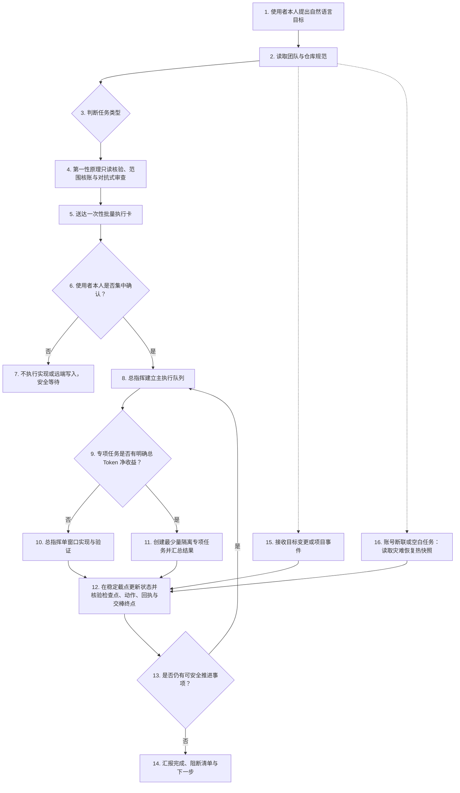

# 第二代总指挥工作流总览

版本：2026-08-30.1

定位：适配 Codex Desktop 与 GitHub 协作的“自然语言目标 + 单窗口主执行总指挥 + Goal + 例外专项任务”工作流。

状态：受控试运行。默认采用单窗口主执行；例外专项任务按总 Token 净收益判断。远端写入确认、稳定截点、高资源授权、未知修改保护和异常回退等安全门禁继续保留。

## 1. 一句话说明

本工作流面向 GitHub：使用者只向一个总指挥窗口说明自然语言目标、AI 无法读取的信息和最终授权；总指挥负责只读核验、制卡、实现、验证、状态记录与交付。专项任务只在独立并行、独立审查、证据隔离或能力缺口具有明确净收益时创建。

协作型工作默认分两阶段：先只读扫描并生成一张人话执行卡，确认后才执行卡内修改和远端动作。本地成果、平台回执和授权彼此独立；旧任务、旧快照或聊天历史不能自动继承远端权限。

复杂、争议或反复失败的问题先按 `02` 的第一性原理决策门禁区分事实、因果、真实阻断和辅助噪声；硬门禁不降低，只暂停实际受影响的对象或阶段。

项目用轻量当前视图和状态索引保存可恢复断点，不把聊天、日志和附件复制成第二套事实库。规则入口、交接、会话健康、视觉材料和远端授权的细节分别由 `04/05/07/09/10` 维护，本总览只负责架构和导航。

## 2. 工作流结构

## 3. 四层职责

### 使用者本人层

当前向 AI 发出指令并承担最终确认的人。提出目标、范围、验收标准、优先级和限制；默认只需在批量执行卡形成后集中确认一次。若希望真正只发一条消息就离开，可以在对象、动作和禁止项已经明确时随 Goal 提交精确预授权包，但这不是经验不足阶段的推荐默认值。

### 总指挥层

默认同时负责控制面和主执行面：完成输入完整性、事实核验、范围核账、依赖分析、优先级、资源门禁、实现、测试、localhost 交付、远端授权内执行、状态汇总、动态重规划和流程复盘。为避免角色混淆，按“控制与制卡 → 主执行 → 验证 → 稳定截点记账”分阶段工作；作者自检不得冒充仓库要求的独立 Review 或专业验收。

### 专项任务层

专项任务是例外能力，不是固定执行层。只有以下至少一项成立且预计节省的关键路径或上下文成本明确大于固定规则载入、重复取证、派发、等待、回执和再汇总成本时才创建：边界独立并有真实并行收益；规则要求独立审查；批量高成本证据适合隔离；主窗口缺少必要能力。一个专项任务只负责一个边界清楚、可独立交付和验证的单元，结束时回传最小结果增量。不得因“代码应由专项做”而拆分同一根因、同一 PR、同一 worktree、连续 UI 反馈或普通局部实现。

### 项目实例层

保存具体项目的代码、规则、Issue、PR、成员、路径、当前目标、任务状态、Base/Head、测试结果、交接记录和 `AI状态索引.md`。第二代抽象层只保存索引规范，不得写入这些实例数据。

## 4. 事实优先级

当前代码和测试结果 > 当前 Git/GitHub 状态 > 项目规则和状态入口 > 已确认的会议记录 > 旧聊天记录和旧 AI 结论。

无法确认的内容统一标记为“待确认”，不能因为旧文档写过就当作当前事实。

## 4.1 永久规则优先级

系统和平台限制 > 当前团队及目标仓库规则 > 分支保护、CODEOWNERS 和 CI 门禁 > 使用者本人本轮授权包 > Goal 与专项任务卡。批量授权不能覆盖更高层规则；团队文档禁止的动作即使被使用者本人误点同意也不得执行。在硬安全边界内，仓库具体流程优先于通用工作流偏好；缺 Reviewer 等低风险流程缺口只暂停受影响阶段，不使全量推进整体停止。

本工作流禁止 Force Push、直接写受保护分支、绕过 Review/CI/分支保护、使用未知凭据和秘密、删除远端历史。即使使用者本人误点同意也不得执行；确有灾难恢复等例外需求时，必须退出本工作流，改用团队正式事故流程和专门审计。

## 5. 七类执行模式

1. 普通目标：处理一个有限目标，默认使用一个 Goal，由总指挥在单一主窗口完成实现与验证；只有通过总 Token 净收益门禁时才增加最少量专项任务。
2. 规划转交付：把会议、问题或路线规划去重并转为 Issue；端到端模式可在精确授权后继续实现、测试和创建真实 PR，仅建档模式停在 Issue。
3. 本地闭环实现与集中发布准备：先在隔离本地环境完成实现、验证和人工验收，再按当前责任与 PR Head 生成独立远端发布卡；本地 Commit 不等于 Push。
4. 协作队列全量接管推进：在目标和协作证据范围内重建完整候选集，区分执行、依赖和排除对象，并保存可靠截点。
5. 协作队列增量推进与覆盖核账：从可靠截点处理变化、未闭环旧账和派生对象；截点不可靠时退回全量推进。
6. 控制面工作：只汇报进展、拓扑、状态变化、目标变更、交接或复盘，不启动产品实现。
7. 空白账号灾难恢复：旧任务不可用时，从项目入口、热快照、索引和当前 Git/平台事实只读恢复；不继承旧授权，也不重做已有完成凭证的批次。

七类模式的候选算法、Review/分支判断和逐对象状态以 `02` 为准，状态恢复以 `04/10` 为准，授权以 `09` 为准。本页不复制其详细条件。

## 6. 与旧版或其他工作流的关系

新用户无需了解或准备任何旧版文件，直接从 `01-操作者操作手册.md` 开始。只有项目已经运行另一套总指挥工作流时，才按 `08-旧版兼容与迁移规范.md` 进行只读映射、事实核验和切换；旧任务、授权、进程与完成声明不得直接继承。

## 7. 推荐使用顺序

- 人类只需先看 `01-操作者操作手册.md`。
- 总指挥首次启动时读取 `02-总指挥核心规则.md`。
- 只有通过专项任务总 Token 净收益门禁时，才按 `03-专项任务卡模板.md` 创建最少量例外任务。
- 动态变更和交接按 `04-状态、目标变更与交接规范.md`、`07-总指挥交接记录模板.md`；正常交接候选的第一次只读按 `总指挥轻量交接启动配置.md`。
- 模型配置按 `05-模型选择与资源策略.md`，复盘按 `06-复盘与优化规则.md`。
- 授权和风险分级按 `09-自动化授权与风险分级.md`。自动 ID、快照、游标和历史检索按 `10-自动状态索引规范.md`。
- 浏览器、真实媒体、模型、跨版本或人工结论冲突的自动化测试，按 `02` 的触发接口完整读取 `docs/AUTOMATED_TESTING_LESSONS.md`；它只约束测试结果可信度，不产生授权，也不进入 00～10 正式规则编号。

完整编号注册表如下。表中只保存可分发的相对文件名；具体电脑上的绝对路径只能写入项目实例的 `AI状态索引.md`。

| 编号 | 相对文件名 | 主要用途 |
|---|---|---|
| 00 | `00-第二代工作流总览.md` | 总览、导航与编号注册表 |
| 01 | `01-操作者操作手册.md` | 使用者入口与可复制场景提示词 |
| 02 | `02-总指挥核心规则.md` | 单窗口主执行内核、路由与停止条件 |
| 03 | `03-专项任务卡模板.md` | 例外专项任务契约与回传格式 |
| 04 | `04-状态、目标变更与交接规范.md` | 状态、变化、证据摘要与交接 |
| 05 | `05-模型选择与资源策略.md` | 模型、Token 与资源选择 |
| 06 | `06-复盘与优化规则.md` | 复盘、规则修改闭环与文档治理 |
| 07 | `07-总指挥交接记录模板.md` | 交接记录结构 |
| 08 | `08-旧版兼容与迁移规范.md` | 可选的旧版兼容与迁移边界；新用户跳过 |
| 09 | `09-自动化授权与风险分级.md` | 风险、授权与远端写入门禁 |
| 10 | `10-自动状态索引规范.md` | 本地索引、规则入口、指纹与截点 |

非编号启动配置：`总指挥轻量交接启动配置.md`。它只服务场景 6A 的候选只读和最终切换前复核，不扩展 00～10 编号注册表，也不代替后续动作所需的正式编号规则。

按需执行手册：`docs/AUTOMATED_TESTING_LESSONS.md`。它具有独立读者、独立更新周期和按需加载价值，因此作为支持文档维护；其权限与冲突优先级仍服从 00～10 正式规则和项目规则，不加入轻量交接固定来源清单。
